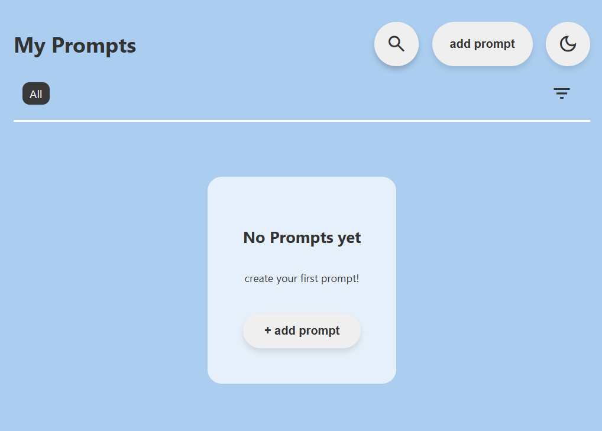
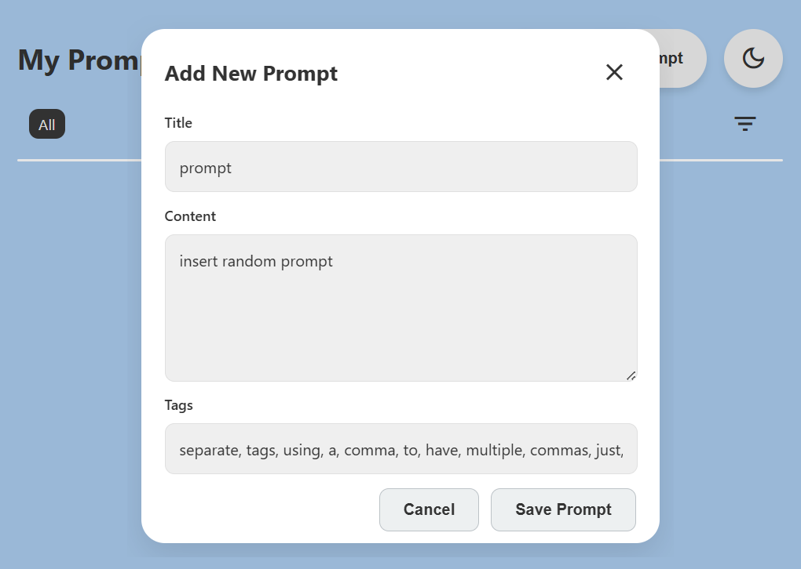

# Echo: prompts that echo through your chats.

Echo is a prompt browser extension for AI chatbots. Save, organize, and insert your best AI prompts with a single click directly into your favorite ai chatbots

[Install for Chrome/Chromium](#installation) | [Install for Firefox](#installation)

## Features:

*   Save and organize prompts with titles, content, and tags.
*   Click any prompt to insert it directly into the active input field of supported AI chat websites.
*   Smart search and filter to Quickly find prompts by title, content, or tags.
*   Drag & Drop Reordering to Easily organize your prompt list.
*   Dark/Light mode for Comfortable viewing, day or night.
*   Press `Ctrl+K` (or `Cmd+K`) to quickly open the add prompt dialogue.
*   All data is stored locally within your browser profile.

## Screenshots:

  
  
  

## Installation:

**Prerequisites:** A Chromium-based browser (Brave, Chrome, Edge...) or Firefox (zen, librewolf...).

**Option 1: Download Pre-Built Package from Releases**

Pre-built packages for Chrome/Chromium and Firefox are available on the [Releases](https://github.com/raoufblz/echo-prompt/releases) page. Download the appropriate `.zip` file and follow the manual installation steps below.

**Option 2: Install from Source (Developer/Testing)**

1.  Clone or download this repository.
2.  Navigate to the `dist` folder.
3.  Select the appropriate build:
    *   For Chrome/Chromium: Use the `dist/chromium` folder or `dist/chromium.zip`.
    *   For Firefox: Use the `dist/firefox` folder or `dist/firefox.zip`.
4.  **Chrome/Chromium:**
    *   Open `chrome://extensions`.
    *   Enable "Developer mode" (usually a toggle in the top right).
    *   Click "Load unpacked".
    *   Select the `dist/chromium` folder.
5.  **Firefox:**
    *   Open `about:debugging#/runtime/this-firefox`.
    *   Click "Load Temporary Add-on".
    *   Select the `manifest.json` file inside the `dist/firefox` folder, or select the `dist/firefox.zip` file.

## Usage:

1.  Click the Echo extension icon in your browser toolbar to open the popup.
2.  Click "Add Prompt" to save a new prompt.
3.  Give your prompt a title, paste the content, add optional tags (comma-separated), and save.
4.  Navigate to a supported AI chat website (e.g., chat.deepseek.com, claude.ai...).
5.  Click into the chat input field where you want the prompt.
6.  Open the Echo popup again.
7.  Find your prompt (use search/tags if needed) and click the "Insert" button (chat_paste_go icon).
8.  The prompt text will be inserted directly into the chat input. Press Enter to submit.

## Supported AI Chat Websites:

Currently supports inserting prompts into:

*   DeepSeek
*   Qwen (Tongyi Lab)
*   Kimi (Moonshot AI)
*   Claude (Anthropic)
*   gemini (google)
*   Perplexity
*   T3 Chat
*   *(More can be added by updating the `manifest.json` files)*

## Building the Extension:

1.  Ensure you have Node.js installed.
2.  Install dependencies (if `archiver` or `fs-extra` are listed in `package.json`, otherwise they need to be installed): `npm install fs-extra archiver`
3.  Run the build script: `node scripts/build.js`
4.  This will generate `dist/chromium.zip` and `dist/firefox.zip`.

## Potential future additions:

*   **Placeholders:** Add support for dynamic placeholders (e.g. `[topic]`).
*   **Favorites:** Ability to mark prompts as favorites.
*   **Improved Data Storage:** Explore options beyond `localStorage` for larger libraries.
*   **Enhanced UI/UX:** Refinements based on feedback.

## Structure:

<pre>
echo-prompt/
├── README.md
├── .gitignore
├── src/
│   ├── popup.js
│   ├── content.js
│   ├── darkmode.js
│   ├── popup.css
│   └── popup.html
├── manifest/
│   ├── manifest-chromium.json
│   └── manifest-firefox.json
└── scripts/
    └── build.js
</pre>

## Contributing:

Contributions are welcome! Please feel free to submit issues or pull requests.
