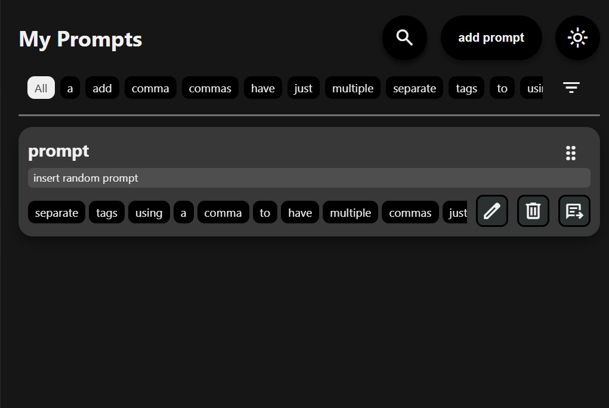

A browser extension that lets you save, edit, tag, delete and insert prompts

<pre>
prompts-manager/
├── README.md
├── .gitignore
├── src/
│   ├── popup.js
│   ├── content.js
│   ├── darkmode.js
│   ├── popup.css
│   └── popup.html
├── manifest/
│   ├── manifest-chromium.json
│   └── manifest-firefox.json
└── scripts/
    └── build.js
</pre>

## Features:
 - Add (ctrl+k) / edit / delete & insert prompts ✅
 - Search titles & content✅
 - click to insert into your chat ✅
 - light / dark theme mode ✅
 - tags ✅
 - drag and drop to organize ✅
 - favorites (soon)
 - placeholders (soon?????)

## screenshots:

  
  
  

## Build & Packages:

    
| Target | Command | Output |
|--------|---------|--------|
| **Chromium-based browsers** (Manifest V3) | `node scripts/build.js` | `dist/chromium.zip` |
| **Firefox-based browsers** (Manifest V2) | `node scripts/build.js` | `dist/firefox.zip` |

